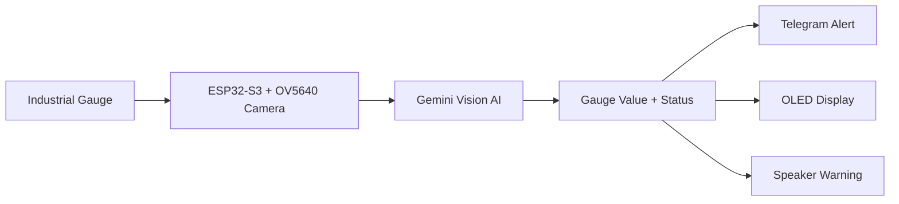
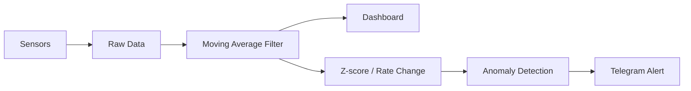
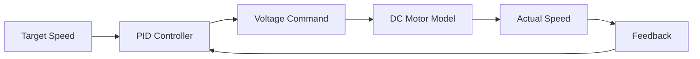
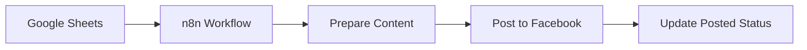

<p align="center">
  
</p>

<p align="center">
  
</p>

<p align="center">
  
  
  
</p>

<p align="center">
  
  
  
  
  
  
  
</p>

---

## ⚡ About Me

I am a **Mechatronics Engineering student at KMUTT** who enjoys transforming **ordinary engineering systems** into **modern, intelligent, and more valuable systems** by adding:

- **AI / Machine Learning**
- **Dashboards & Data Visualization**
- **Alert Systems**
- **Automation Workflows**
- **Embedded & Hardware Integration**

> My goal is to combine what I learn from university with self-taught modern technologies to build systems that **reduce company costs**, **improve efficiency**, and **increase business value**.

---

## 🎯 Engineering Identity

```txt
Normal system
   ↓
Add sensors / control / data / dashboard / alerts / AI
   ↓
Smarter system
   ↓
Lower cost + better decisions + higher operational value
```

---

## 🚀 Featured Engineering Projects

## 🧠 1) AI Industrial Gauge Reader

An embedded AI system for reading industrial gauge values and resistor color codes using **ESP32-S3**, **camera vision**, **Gemini AI**, **Telegram alerts**, **OLED display**, and **speaker warning**.



### 🔧 What I built
- ESP32-S3 based embedded system  
- OV5640 camera for gauge capture  
- Gemini AI API for image analysis  
- Telegram Bot API for remote alerting  
- OLED I2C display for local output  
- I2S speaker for danger alert  
- Resistor color-code calculator flow  

### 💼 Business value
- Reduces human reading errors  
- Speeds up abnormal-condition detection  
- Supports remote monitoring  
- Provides a path toward predictive maintenance  

### 🧩 Stack
`ESP32-S3` `OV5640` `Gemini AI` `Telegram API` `I2C` `I2S` `HTTPS` `JSON`

### 🔥 Next step
- TinyML deployment  
- OpenCV-based gauge detection  
- More local / edge AI processing  

---

## 🌡️ 2) Mini Server Room Monitoring

A smart environmental monitoring system for tracking **temperature**, **humidity**, and **abnormal conditions** with **filtering**, **dashboard visualization**, and **alert logic**.



### 🔧 What I built
- Temperature and humidity monitoring  
- Raw vs filtered data comparison  
- Moving average filtering  
- Water leak alert logic  
- Z-score based anomaly detection  
- Dashboard visualization  
- Telegram notification flow  

### 💼 Business value
- Reduces manual inspection  
- Detects problems earlier  
- Improves visibility through dashboards  
- Helps create data-driven maintenance decisions  

### 🧩 Stack
`Sensors` `Dashboard` `Moving Average Filter` `Z-score` `Anomaly Detection` `Telegram Alert`

---

## 🎛️ 3) PID Web Control Simulator

A web-based PID dashboard for visualizing **control response**, **manual tuning**, **auto PID tuning**, and engineering performance metrics before real-world implementation.



### 🔧 What I built
- Adjustable **Kp / Ki / Kd**  
- Manual PID tuning mode  
- Auto PID tuning mode  
- Step response visualization  
- Error / Voltage / Current / Torque graphs  
- Disturbance load simulation  
- PID term visualization  

### 💼 Business value
- Helps tune control before using hardware  
- Reduces trial-and-error time  
- Makes system behavior easier to analyze  
- Useful for learning, prototyping, and engineering design  

### 🧩 Stack
`PID Control` `Control Systems` `Dashboard` `Simulation` `HTML` `CSS` `JavaScript`

---

## 🔁 4) n8n Facebook Auto Post Workflow

An automation workflow for posting content automatically to Facebook and updating status in Google Sheets.



### 🔧 What I built
- n8n workflow automation  
- Google Sheets integration  
- Facebook post automation  
- Automatic status update  
- Reduced repetitive manual work  

### 💼 Business value
- Saves time  
- Reduces human error  
- Improves workflow consistency  
- Supports scalable content operations  

### 🧩 Stack
`n8n` `Google Sheets` `Facebook` `API Integration` `Workflow Automation`

---

## 🧠 Core Engineering Skills

<table>
<tr>
<td width="50%" valign="top">

### 🤖 AI, ML & Automation
- Prompt Engineering  
- AI-assisted coding / debugging / documentation  
- OpenAI Codex & GitHub Copilot workflow  
- Local LLM deployment using Ollama  
- Basic RAG workflow  
- ML concept for anomaly detection  
- n8n workflow design  
- Applying AI to engineering systems  

</td>
<td width="50%" valign="top">

### ⚙️ Embedded Systems & Hardware Integration
- ESP32 / ESP32-S3 development  
- Sensor interfacing and data acquisition  
- Camera integration  
- OLED / display integration  
- I2C, I2S, GPIO  
- HTTPS / JSON / API communication  
- Speaker and alert module integration  
- Able to connect sensors, displays, and external hardware into working systems  

</td>
</tr>

<tr>
<td width="50%" valign="top">

### 🏭 PLC & Industrial Automation
- PLC programming using Ladder Diagram  
- Omron / Mitsubishi PLC familiarity  
- Sequential control logic  
- Input / output control  
- Industrial automation thinking  
- Experience teaching PLC fundamentals to students  
- Able to explain PLC logic clearly to beginners  

</td>
<td width="50%" valign="top">

### 🎛️ Control Systems & Signal Processing
- PID control theory  
- Manual and auto PID tuning  
- Step response analysis  
- Overshoot / settling time evaluation  
- Moving Average Filter  
- Low-pass / Exponential Smoothing  
- Median Filter  
- Noise reduction and signal conditioning  

</td>
</tr>

<tr>
<td width="50%" valign="top">

### 🔋 Robotics Hardware & Practical Wiring
- TRCC robotics club experience  
- Robot electrical wiring  
- Battery selection for robot systems  
- Wire cutting, crimping, soldering, connector preparation  
- DIY modification and troubleshooting  
- Practical power distribution understanding  
- Experience building competition robots under real constraints  

</td>
<td width="50%" valign="top">

### ⚡ Electrical, Power & Circuit Systems
- Circuit analysis  
- Thevenin’s / Norton’s Theorem  
- Three-phase motor wiring  
- Star-Delta motor starter  
- Inrush current reduction concept  
- Electrical drawing reading  
- Basic power / load calculation  
- Motor wiring lab experience  

</td>
</tr>

<tr>
<td width="50%" valign="top">

### 📊 Engineering Statistics & Data Analytics
- Descriptive Statistics  
- ANOVA  
- Duncan's Multiple Range Test  
- Chi-square Test  
- Welch's t-test  
- Simple Linear Regression  
- Lack-of-Fit Test  
- Mann-Whitney U Test  
- Run Test  
- Logistic Regression  
- Engineering data interpretation  

</td>
<td width="50%" valign="top">

### 🏗️ Manufacturing, CAD & Fabrication
- Manual milling machine operation  
- Face / Angular / Side Milling  
- TIG / MIG / SMAW welding theory  
- Autodesk Inventor 3D modeling  
- Mechanical drawing interpretation  
- Electrical drawing interpretation  
- Hydraulic and Pneumatic fundamentals  
- Hands-on fabrication mindset from robotics and project work  

</td>
</tr>
</table>

---

## 💼 Engineering Value I Want to Create

<table>
<tr>
<td align="center" width="25%">
  <h2>01</h2>
  <b>Reduce Cost</b>
  <p>Use automation, monitoring, and smarter workflows to reduce repetitive work and avoid unnecessary losses.</p>
</td>
<td align="center" width="25%">
  <h2>02</h2>
  <b>Increase Efficiency</b>
  <p>Improve speed and visibility through dashboards, alerts, and better engineering decisions.</p>
</td>
<td align="center" width="25%">
  <h2>03</h2>
  <b>Prevent Problems</b>
  <p>Apply monitoring, analytics, and anomaly detection to catch issues before they become serious.</p>
</td>
<td align="center" width="25%">
  <h2>04</h2>
  <b>Create Business Value</b>
  <p>Turn engineering systems into tools that improve operations, productivity, and future revenue opportunities.</p>
</td>
</tr>
</table>

---

## 🏆 Academic Highlights

<p align="center">
  
  
  
</p>

### Courses / Areas I am proud of

| Area | Highlights |
|---|---|
| **Engineering Statistics** | ANOVA, Duncan, Chi-square, Welch's t-test, Linear Regression, Lack-of-Fit, Logistic Regression |
| **Computer System & Interfacing** | Protocol data frames, ALU operation, Fetch-Decode-Execute cycle, embedded interfacing |
| **Engineering Computation** | Linear Algebra, Laplace Transform, State Space, Impulse Response, engineering simulation |
| **Engineering Mechanics** | Free Body Diagram, equilibrium, force and moment analysis |
| **Electrical Power** | Three-phase motor wiring, Star-Delta starter, power laboratory work |
| **Manufacturing** | Milling operations, welding theory, fabrication process, CAD drawing |
| **Industrial Automation** | PLC Ladder Diagram, automation control logic, technical teaching experience |

---

## 🛠️ Tech Stack

<p align="center">
  
</p>

<p align="center">
  
  
  
  
  
  
  
</p>

---

## 📊 GitHub Stats

<p align="center">
  
  
</p>

<p align="center">
  
</p>

---

## 🎯 Current Focus

<p align="center">
  
  
  
  
  
</p>

<p align="center">
  I am currently focusing on building intelligent engineering systems that connect hardware, collect data, analyze system behavior, and respond automatically to create real business impact.
</p>

---

## 📫 Contact

<p align="center">
  <a href="mailto:chalermchaipakinthon@gmail.com">
    
  </a>
  <a href="https://github.com/chalermchaipakinthon-alt">
    
  </a>
</p>

---

<p align="center">
  <b>Building smarter systems through AI, mechatronics, control, PLC, data analytics, and automation.</b>
</p>

<p align="center">
  
</p>
